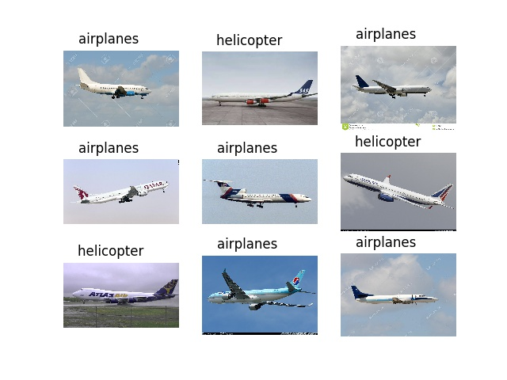

# CNN_object_classification
Use CNN and VGG structure to train 3 datasets:
* CIFAR10
* CIFAR100
* Caltech101
Save the trained model, then use webcam and django to write a simple web application. [link](https://github.com/willylulu/PRfinal)

### Install
1. Install tensorflow and keras
2. Download [caltech dataset](http://www.vision.caltech.edu/Image_Datasets/Caltech101/)
3. Run train/Train_CIFAR10_CIFAR100.ipynb or train/Train_caltech.py

### Training Result

|   Dataset  |  Training acc | Testing acc |   | Runnung time |
|------------|:-------------:|:-----------:| - |:------------:|
| CIFAR10    |      98%      |     80%     |   |    16 min    |
| CIFAR100   |      89%      |     71%     |   |     7  hr    |
| Caltech101 |      90%      |     65%     |   |     1  hr    |

### Web application
The first block is the webcam preview window, and the little block near it is the image that we want to predict.
After running backend prediction, it would show the predicted result.

### Other result
<table border=1 >
<tr align="center">
<td colspan="2"> CIFAR10 </td>
</tr>
<tr align="center">
<td >  </td>
<td >  </td>
</tr>
<tr align="center">
<td colspan="2"> CIFAR100 </td>
</tr>
<tr align="center">
<td >  </td>
<td >  </td>
</tr>
<tr align="center">
<td >  </td>
<td >  </td>
</tr>
</tr>
<tr></tr>
<tr align="center">
<td colspan="2"> Caltech101 </td>
</tr>
<tr align="center">
<td >  </td>
<td >  </td>
</tr>
<tr align="center">
<td >  </td>
<td >  </td>
</tr>
</table>
